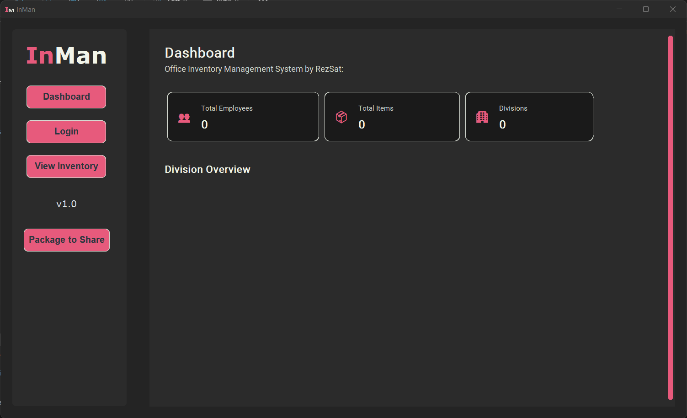
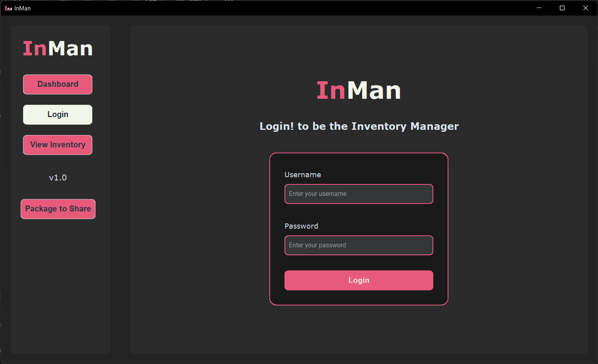
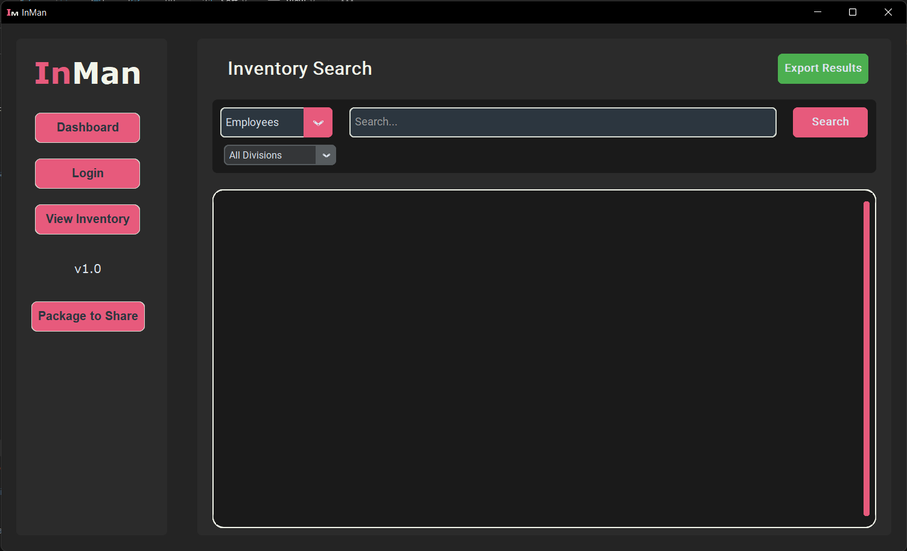

# An Inventory Management System

### Overview
The Inventory Management System (InMan) is designed to manage and track inventory owned by employees at E.T.F.B. This application allows users to efficiently handle various aspects of inventory management, including employee assignments, item tracking, and division management.

### Features
- **Advanced Search Functionality**: Users can search for employees, items, divisions, and unique keys with advanced filtering options.
- **Export Capabilities**: Export search results to Excel with formatted output, including custom styling and auto-column width adjustment.
- **Division Management**: Manage divisions within the organization, track employees, and monitor item assignments.
- **Item Management**: Handle inventory items with dynamic attributes and status tracking (active, retired, lost).
- **Employee Management**: Manage employee records, including item assignments and tracking.
- **Transfer History Tracking**: Keep a record of item transfers between employees.
- **User Authentication and Action Logging**: Ensure secure access and maintain logs of user actions.

### Database Schema
The application uses the following database models:
- **Division**: Represents divisions within the organization.
- **Employee**: Represents employees, linked to divisions and items.
- **Item**: Represents inventory items, with attributes and status.
- **EmployeeItem**: An associative table linking employees to items.
- **ItemAttribute**: Represents dynamic attributes for items.
- **User**: Represents system users (managers).
- **Log**: For logging actions performed in the system.
- **ItemTransferHistory**: Tracks the history of item transfers between employees.

### Search Capabilities
- **Multi-type Search**: Supports searching for employees, items, divisions, and unique keys.
- **Advanced Filtering Options**: Users can apply filters based on search type to refine results.
- **Real-time Search Results Display**: Results are displayed in a grid format for easy viewing.

### Export Features
- **Excel Export**: Users can export search results to an Excel file with specific formatting.
- **Custom Styling**: The exported files include custom styling for better readability.
- **Support for Different Data Types**: The export functionality accommodates various data types and layouts.

### User Interface
The application features a user-friendly interface built with customtkinter, providing an intuitive experience for managing inventory and performing searches.

### Project Structure

```
inventory_management_app/
│
├── main.py                        # Entry point for the application
│
├── config/
│   └── config.py                  # Configuration settings ( mostly using for anything i feel like capitalizing.)
│
├── controllers/
│   ├── Contains Authorization, CRUD logic
│
├── models/
│   ├── models py                  # Well it has models for or the application
|   ├── database.py                #
DB connection, Session handling.
│
├── gui/
│   ├── As the name suggests it's the UI code using customtkinter.
│
├── utils/                         #
Some reusable utility functions lies here including search functions
```

### Database Schema in detail

#### 1. **Employee Table**
   *Now includes division ID as a foreign key and keeps track of each employee's division and details.*

| Column          | Type    | Description                           |
|-----------------|---------|---------------------------------------|
| emp_id          | String  | Unique ID for each employee          |
| name            | String  | Employee name                        |
| division_id     | Integer | Foreign key to `Division`            |
| item_count      | Integer | Total number of assigned items       |
| date_joined     | Date    | Date employee joined the company     |

#### 2. **Division Table**
   *Includes a count of employees in each division.*

| Column           | Type    | Description                          |
|------------------|---------|--------------------------------------|
| division_id      | Integer | Unique ID for each division         |
| name             | String  | Name of the division                |
| employee_count   | Integer | Number of employees in this division|

#### 3. **Item Table**
   *Now includes additional details for item status and history tracking.*

| Column          | Type    | Description                           |
|-----------------|---------|---------------------------------------|
| item_id         | Integer | Unique ID for each item              |
| name            | String  | Item name                            |
| unique_key      | String  | Unique identifier (e.g., serial)     |
| is_common       | Boolean | Whether the item is common or unique |
| status          | String  | Current status (`active`, `retired`, `lost`, etc.)|
| last_assigned   | Date    | Date when the item was last assigned |

#### 4. **EmployeeItem Table** (Associative Table for Many-to-Many Relationship)
   *Tracks unique or shared items and keeps records of item ownership.*

| Column          | Type    | Description                           |
|-----------------|---------|---------------------------------------|
| id              | Integer | Primary key                          |
| emp_id          | String  | Foreign key to `Employee`            |
| item_id         | Integer | Foreign key to `Item`                |
| is_unique       | Boolean | Indicates if item is unique to this employee |
| date_assigned   | Date    | Date when item was assigned          |
| notes           | Text    | Additional notes (e.g., item conditions) |

#### 5. **User Table** (For System Manager)
   *Manager login table.*

| Column          | Type    | Description                           |
|-----------------|---------|---------------------------------------|
| user_id         | Integer | Unique ID for user                   |
| username        | String  | Login username                       |
| password        | String  | Hashed login password                |
| role            | String  | Role of the user (`manager`)         |

#### 6. **Log Table**
   *Enhanced to log all user actions, including system changes, searches, and item updates.*

| Column          | Type      | Description                           |
|-----------------|-----------|---------------------------------------|
| log_id          | Integer   | Unique ID for each log entry         |
| action_type     | String    | Type of action (`search`, `add_item`, etc.) |
| details         | Text      | Additional action details            |
| timestamp       | DateTime  | When the action occurred             |
| user_id         | Integer   | Foreign key to `User` performing the action (nullable for searches) |

#### 7. **ItemTransferHistory Table**
   *Tracks historical transfers of items between employees.*

| Column          | Type      | Description                           |
|-----------------|-----------|---------------------------------------|
| transfer_id     | Integer   | Unique ID for each transfer entry    |
| item_id         | Integer   | Foreign key to `Item`                |
| from_emp_id     | String    | Employee ID of the previous holder   |
| to_emp_id       | String    | Employee ID of the new holder        |
| transfer_date   | Date      | Date of transfer                     |
| notes           | Text      | Optional notes (e.g., reason for transfer)|

---

### Screenshots





